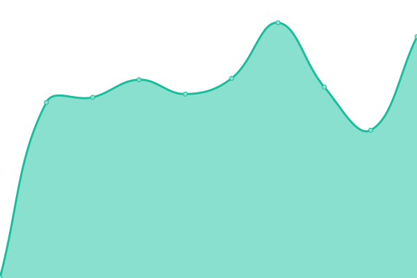
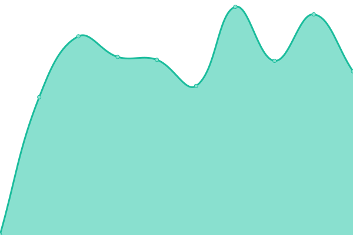

# [📈 Live Status](https://team-mirai-volunteer.github.io/upptime): <!--live status--> **🟩 All systems operational**

This repository contains the open-source uptime monitor and status page for [チームみらいサポーター](https://team-mir.ai), powered by [Upptime](https://github.com/upptime/upptime).

With [Upptime](https://upptime.js.org), you can get your own unlimited and free uptime monitor and status page, powered entirely by a GitHub repository. We use [Issues](https://github.com/team-mirai-volunteer/upptime/issues) as incident reports, [Actions](https://github.com/team-mirai-volunteer/upptime/actions) as uptime monitors, and [Pages](https://team-mirai-volunteer.github.io/upptime) for the status page.

<!--start: status pages-->
<!-- This summary is generated by Upptime (https://github.com/upptime/upptime) -->
<!-- Do not edit this manually, your changes will be overwritten -->
<!-- prettier-ignore -->
| URL | Status | History | Response Time | Uptime |
| --- | ------ | ------- | ------------- | ------ |
|  [Website](https://team-mir.ai) | 🟩 Up | [website.yml](https://github.com/team-mirai-volunteer/upptime/commits/HEAD/history/website.yml) | 

 584ms
     
 | 

<a href="https://team-mirai-volunteer.github.io/upptime/history/website">71.44%</a>
    

|  [Marumie](https://marumie.team-mir.ai/o/team-mirai) | 🟩 Up | [marumie.yml](https://github.com/team-mirai-volunteer/upptime/commits/HEAD/history/marumie.yml) | 

 652ms
     
 | 

<a href="https://team-mirai-volunteer.github.io/upptime/history/marumie">71.44%</a>
    

|  [Mirai Gikai](https://gikai.team-mir.ai) | 🟩 Up | [mirai-gikai.yml](https://github.com/team-mirai-volunteer/upptime/commits/HEAD/history/mirai-gikai.yml) | 

 614ms
     
 | 

<a href="https://team-mirai-volunteer.github.io/upptime/history/mirai-gikai">71.44%</a>
    

|  [Action Board](https://action.team-mir.ai) | 🟩 Up | [action-board.yml](https://github.com/team-mirai-volunteer/upptime/commits/HEAD/history/action-board.yml) | 

 1565ms
     
 | 

<a href="https://team-mirai-volunteer.github.io/upptime/history/action-board">100.00%</a>
    

<!--end: status pages-->

[**Visit our status website →**](https://team-mirai-volunteer.github.io/upptime)

## 📄 License

- Powered by: [Upptime](https://github.com/upptime/upptime)
- Code: [MIT](./LICENSE) © [Anand Chowdhary](https://anandchowdhary.com), supported by [Pabio](https://pabio.com)
- Data in the `./history` directory: [Open Database License](https://opendatacommons.org/licenses/odbl/1-0/)
